# Chapter 4: System Design

## 4.1. System Architecture Overview

EmpowerWork is a three-tier web application built with FastAPI (backend), React (frontend), and MySQL database:

```
┌─────────────────────┐
│   Frontend (React)  │  
│  - SPA with Vite   │  
│  - Tailwind CSS    │  
│  - Dark Mode       │  
└─────────────────────┘
          │ HTTP/REST (Axios)
          ▼
┌─────────────────────────────────────┐
│    API Layer (FastAPI)              │
│  - 7 route modules                  │
│  - CORS, Rate Limiting              │
│  - Authentication & Authorization   │
└─────────────────────────────────────┘
          │ SQLAlchemy ORM
          ▼
┌─────────────────────┐
│  Data Layer (MySQL) │  
│  - 12 entities      │  
│  - 4 association    │  
│    tables           │  
└─────────────────────┘
```

---

## 4.2. Component Architecture

### Backend Modules

```
backend/src/
├── main.py              # FastAPI app entry point
├── config.py            # Configuration
├── db/
│   ├── database.py      # SQLAlchemy connection
│   └── models.py        # 12 data models + associations
├── routes/
│   ├── users.py         # User CRUD, registration
│   ├── jobs.py          # Job search, listing
│   ├── applications.py  # CV upload, application tracking
│   ├── chat.py          # RAG chatbot endpoint
│   ├── disabilities.py  # Disability management
│   ├── tools.py         # Assistive tools
│   ├── companies.py     # Company CRUD
│   └── security.py      # Security monitoring
├── rag/
│   ├── rag_chat.py      # Groq API integration
│   ├── embedder.py      # Text embeddings (optional)
│   └── retriever.py     # Vector search (optional)
├── middleware/
│   └── security_middleware.py
└── utils/
    ├── security.py              # Validation, sanitization, rate limiting
    ├── search_intelligence.py   # Job matching, filtering, relevance scoring
    └── pdf_extractor.py         # CV text extraction
```

### Frontend Structure

```
frontend/src/
├── App.jsx              # Main app, routing
├── main.jsx             # Entry point
├── context/
│   └── AuthContext.jsx  # User auth state (localStorage)
├── api/
│   └── api.js           # Axios instance, HTTP client
├── components/          # 10 reusable components
│   ├── Navbar.jsx       # Navigation, auth UI
│   ├── Footer.jsx       # Footer
│   ├── JobCard.jsx      # Job card display
│   ├── JobForm.jsx      # Admin job creation
│   ├── UserForm.jsx     # Profile edit form
│   ├── ApplicationModal.jsx   # CV upload & manual entry
│   ├── ChatBox.jsx      # Chatbot interface
│   ├── Table.jsx        # Admin CRUD tables
│   └── AccessibilityControls.jsx  # Accessibility settings
├── pages/               # 15 page components
│   ├── Home.jsx         # Job search & listing
│   ├── Profile.jsx      # User profile
│   ├── Chat.jsx         # Chatbot page
│   ├── Tools.jsx        # Assistive tools
│   ├── Register.jsx     # User registration
│   ├── Login.jsx        # User login
│   └── Admin*.jsx       # 7 admin pages
└── utils/               # Utilities
```

---

## 4.3. Data Flow Diagrams (DFD)

### 4.3.1. DFD Level 0 (Context Diagram)

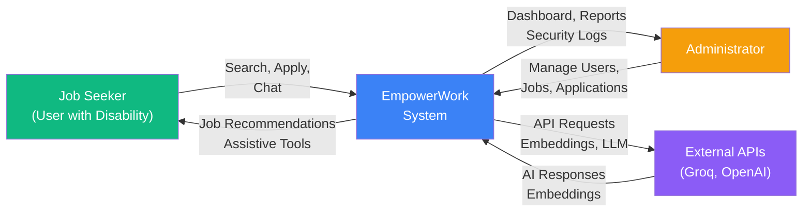

---

### 4.3.2. DFD Level 1 (Process & Data Flows)

#### Main Data Flow: User Registration

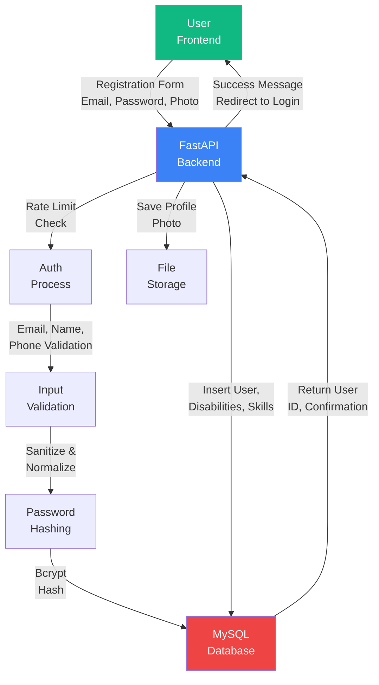

#### Main Data Flow: Job Search & Matching

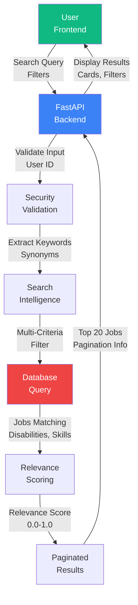

#### Main Data Flow: Job Application with CV

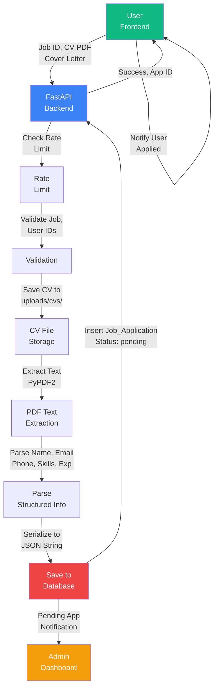

#### Main Data Flow: Chatbot Interaction

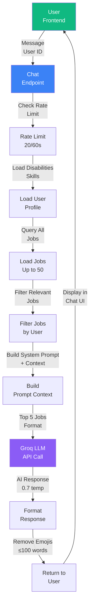

---

## 4.4. State Diagrams

### 4.4.1. Job Application State Machine

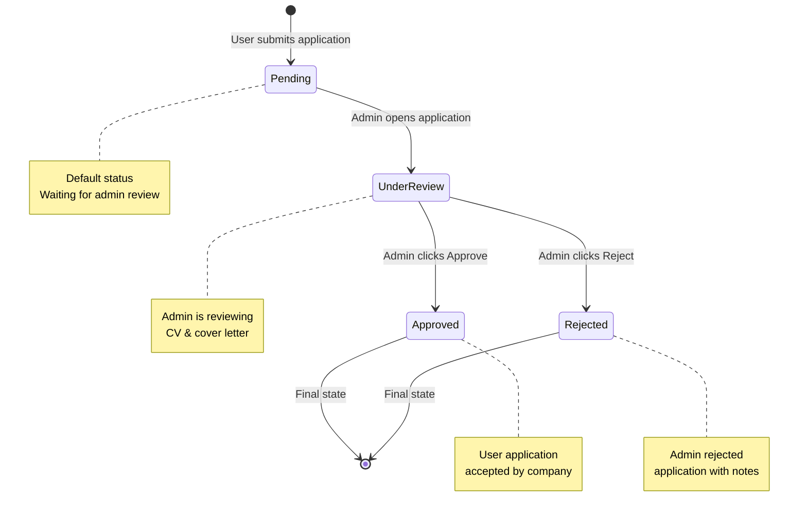

### 4.4.2. User Session State Machine

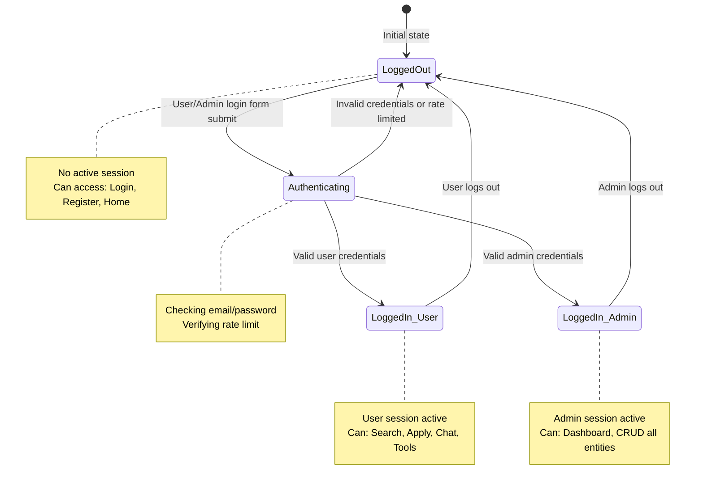

### 4.4.3. Job Search Filter State

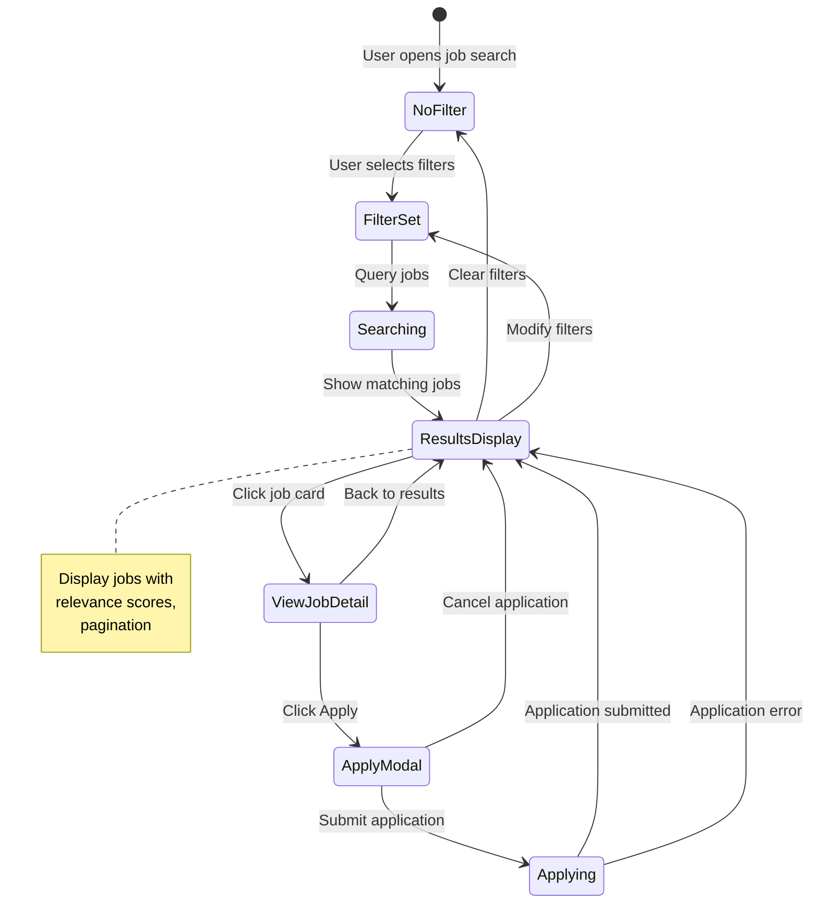

---

## 4.5. Use Case Diagrams

### 4.5.1. Job Seeker Use Cases

```mermaid
graph TB
    JobSeeker["🧑 Job Seeker"]
    
    JobSeeker -->|UC-1| Register["Register Account<br/>+ Disabilities, Skills"]
    JobSeeker -->|UC-2| Login["Login"]
    JobSeeker -->|UC-3| Profile["View/Edit Profile"]
    
    JobSeeker -->|UC-4| Search["Search Jobs<br/>Intelligent Filtering"]
    JobSeeker -->|UC-5| View["View Job Details"]
    
    JobSeeker -->|UC-6| ApplyCv["Apply with CV<br/>PDF Upload"]
    JobSeeker -->|UC-7| ApplyManual["Apply Manual Entry<br/>No CV"]
    
    JobSeeker -->|UC-8| ViewApps["View Applications<br/>History & Status"]
    
    JobSeeker -->|UC-9| Chat["Chat AI Assistant<br/>Job Recommendations"]
    
    JobSeeker -->|UC-10| Tools["Browse Assistive Tools<br/>Filter by Disability"]
    
    JobSeeker -->|UC-11| Accessibility["Configure Accessibility<br/>Font, Contrast, Motion"]
    
    style JobSeeker fill:#10B981,color:#fff
    style Register fill:#3B82F6,color:#fff
    style Search fill:#3B82F6,color:#fff
    style ApplyCv fill:#3B82F6,color:#fff
    style Chat fill:#3B82F6,color:#fff
    style Tools fill:#3B82F6,color:#fff
    style Accessibility fill:#3B82F6,color:#fff
```

### 4.5.2. Administrator Use Cases

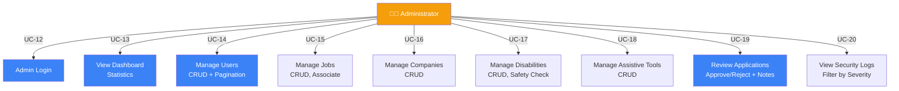

### 4.5.3. System Use Cases

```mermaid
graph TB
    System["🔧 EmpowerWork System"]
    
    System -->|UC-21| ValidateInput["Validate & Sanitize<br/>All User Input"]
    System -->|UC-22| HashPwd["Hash Passwords<br/>Bcrypt ≥12 rounds"]
    System -->|UC-23| RateLimit["Implement Rate Limiting<br/>By Endpoint"]
    
    System -->|UC-24| Match["Intelligent Job Matching<br/>Disability Prioritization"]
    System -->|UC-25| Score["Calculate Relevance Scores<br/>0.0-1.0"]
    System -->|UC-26| Search["Synonym Matching<br/>Fuzzy Search"]
    
    System -->|UC-27| ExtractCV["Extract CV Info<br/>PyPDF2"]
    System -->|UC-28| StoreFiles["Store Files<br/>uploads/ directory"]
    
    System -->|UC-29| IntegrateRAG["Integrate Groq API<br/>RAG Chatbot"]
    System -->|UC-30| ContextBuild["Build Prompt Context<br/>User + Jobs"]
    System -->|UC-31| FormatResponse["Format AI Response<br/>Sanitize & Limit"]
    
    System -->|UC-32| LogEvents["Log Security Events<br/>Threats & Actions"]
    System -->|UC-33| Monitor["Monitor Performance<br/>Query Times"]
    
    style System fill:#8B5CF6,color:#fff
    style ValidateInput fill:#3B82F6,color:#fff
    style Match fill:#3B82F6,color:#fff
    style IntegrateRAG fill:#3B82F6,color:#fff
```

---

## 4.6. User Interface Design

### 4.6.1. Design System

#### Color Palette

**Light Mode:**
- Primary: `#3B82F6` (Blue)
- Secondary: `#F68E3C` (Orange)
- Accent: `#21978C` (Teal)
- Background: `#FFFFFF` (White)
- Text: `#111827` (Gray-900)
- Border: `#E5E7EB` (Gray-200)

**Dark Mode:**
- Primary: `#60A5FA` (Blue-400)
- Secondary: `#FB923C` (Orange-400)
- Accent: `#14B8A6` (Teal-400)
- Background: `#111827` (Gray-900)
- Text: `#F3F4F6` (Gray-100)
- Border: `#374151` (Gray-700)

**High Contrast Mode:**
- Background: `#000000` (Black)
- Text: `#FFFFFF` (White)
- Accent: `#FFFF00` (Yellow)

#### Typography

- **Heading XL:** Inter Bold 32px, line-height 1.2
- **Heading L:** Inter Bold 24px, line-height 1.3
- **Heading M:** Inter Bold 18px, line-height 1.4
- **Body Large:** Inter Regular 16px, line-height 1.5
- **Body Regular:** Inter Regular 14px, line-height 1.6
- **Small:** Inter Regular 12px, line-height 1.5

#### Spacing

- Base unit: 4px (Tailwind: 1 = 4px)
- Padding: 4, 8, 12, 16, 20, 24, 28, 32px
- Margin: Same scale

#### Responsive Breakpoints

| Device | Width | Columns | Layout |
|--------|-------|---------|--------|
| Mobile | < 640px | 1 | Stack, hamburger menu |
| Tablet | 640-1024px | 2 | Side-by-side, simplified nav |
| Desktop | > 1024px | 3-4 | Full layout, sidebar |

---

### 4.6.2. Page Layouts

#### Page: Login

```
┌─────────────────────────────────────┐
│  NAVBAR: Logo | Dark Mode           │
├─────────────────────────────────────┤
│                                      │
│           ┌──────────────────┐       │
│           │  EmpowerWork     │       │
│           │     LOGIN        │       │
│           │                  │       │
│           │ Login Type:      │       │
│           │ [User ▼]         │       │
│           │                  │       │
│           │ Email:           │       │
│           │ [____________]   │       │
│           │                  │       │
│           │ Password:        │       │
│           │ [____________]   │       │
│           │                  │       │
│           │ [Remember me ☐]  │       │
│           │                  │       │
│           │ [Login Button]   │       │
│           │ [Register Link]  │       │
│           └──────────────────┘       │
│                                      │
├─────────────────────────────────────┤
│  FOOTER: © 2025 | Contact | Privacy │
└─────────────────────────────────────┘
```

#### Page: Home (Job Search & Listing)

```
┌──────────────────────────────────────────────┐
│ NAVBAR: Logo | Search | Profile | Chat | Logout
├──────────────────────────────────────────────┤
│                                               │
│ Search: [________________] [🔍 Search]      │
│                                               │
│ [☰ Filters] [Disability ▼] [Skill ▼]       │
│             [Type ▼] [Remote ▼]            │
│                                               │
│ Results: 42 jobs found                       │
│                                               │
│ ┌──────────────┐ ┌──────────────┐           │
│ │ Job Card     │ │ Job Card     │           │
│ │ ┌──────────┐ │ │ ┌──────────┐ │           │
│ │ │ [Logo]   │ │ │ │ [Logo]   │ │           │
│ │ ├──────────┤ │ │ ├──────────┤ │           │
│ │ │ Title    │ │ │ │ Title    │ │           │
│ │ │ Company  │ │ │ │ Company  │ │           │
│ │ │ Location │ │ │ │ Location │ │           │
│ │ │ Score:95%│ │ │ │ Score:88%│ │           │
│ │ │ [Apply]  │ │ │ │ [Apply]  │ │           │
│ │ └──────────┘ │ │ └──────────┘ │           │
│ └──────────────┘ └──────────────┘           │
│                                               │
│ [◀ Prev] [1] [2] [3] [▶ Next]               │
│                                               │
├──────────────────────────────────────────────┤
│ FOOTER                                        │
└──────────────────────────────────────────────┘
```

#### Page: Profile

```
┌──────────────────────────────────────────────┐
│ NAVBAR: Logo | Search | Profile | Chat | Logout
├──────────────────────────────────────────────┤
│                                               │
│ ┌──────────────────┐  ┌──────────────────┐  │
│ │ PROFILE INFO     │  │ MY APPLICATIONS  │  │
│ ├──────────────────┤  ├──────────────────┤  │
│ │                  │  │                  │  │
│ │ [Profile Photo]  │  │ • Software Dev   │  │
│ │ ┌──────────────┐ │  │   Status: Applied│  │
│ │ │              │ │  │   📝 View        │  │
│ │ │    [100x100] │ │  │                  │  │
│ │ │              │ │  │ • Designer       │  │
│ │ └──────────────┘ │  │   Status: Approved│ │
│ │ [Change Photo]   │  │   ✓ View        │  │
│ │                  │  │                  │  │
│ │ Name: John Doe   │  │ • Manager        │  │
│ │ Email: john@...  │  │   Status: Rejected│ │
│ │ Phone: +1...     │  │   ✗ View        │  │
│ │                  │  │                  │  │
│ │ [Edit Profile]   │  │ [View More...]   │  │
│ │                  │  │                  │  │
│ │ Disabilities:    │  │                  │  │
│ │ [Visual ✕] [Mobility ✕]              │  │
│ │                  │  │                  │  │
│ │ Skills:          │  │                  │  │
│ │ [Python ✕] [React ✕]                 │  │
│ │                  │  │                  │  │
│ │ [Add Skills...]  │  │                  │  │
│ │                  │  │                  │  │
│ └──────────────────┘  └──────────────────┘  │
│                                               │
├──────────────────────────────────────────────┤
│ FOOTER                                        │
└──────────────────────────────────────────────┘
```

#### Page: Chat (Chatbot)

```
┌──────────────────────────────────────────────┐
│ NAVBAR: Logo | Search | Profile | Chat | Logout
├──────────────────────────────────────────────┤
│                                               │
│ ┌────────────────────────────────────────┐   │
│ │ 🤖 EmpowerWork Job Assistant          │   │
│ ├────────────────────────────────────────┤   │
│ │                                         │   │
│ │ Assistant: Hello! 👋 I'm here to help │   │
│ │ you find jobs. Tell me what you're    │   │
│ │ looking for!                          │   │
│ │                                         │   │
│ │                                         │   │
│ │ You: I want remote jobs with good     │   │
│ │ accessibility for screen readers      │   │
│ │                                         │   │
│ │                                         │   │
│ │ Assistant: Great! I found 3 remote    │   │
│ │ jobs perfect for you:                 │   │
│ │                                         │   │
│ │ • Software Engineer - TechCorp        │   │
│ │   (PERFECT MATCH - screen reader)     │   │
│ │   Salary: $100k-120k                  │   │
│ │   [View Job] [Apply]                  │   │
│ │                                         │   │
│ │ • QA Analyst - DataInc                │   │
│ │   (Remote, flexible schedule)         │   │
│ │   [View Job] [Apply]                  │   │
│ │                                         │   │
│ │ [Type message...]         [Send]      │   │
│ │                                         │   │
│ └────────────────────────────────────────┘   │
│                                               │
├──────────────────────────────────────────────┤
│ FOOTER                                        │
└──────────────────────────────────────────────┘
```

#### Modal: Job Application (CV Upload)

```
┌────────────────────────────────────────────────┐
│ Apply for: Software Engineer at TechCorp  [✕]  │
├────────────────────────────────────────────────┤
│                                                 │
│ METHOD: [CV Upload] [Manual Entry]            │
│                                                 │
│ CV Upload:                                     │
│ ┌──────────────────────────────────────────┐  │
│ │ [Choose File] (PDF, max 5MB)             │  │
│ │ No file chosen                           │  │
│ └──────────────────────────────────────────┘  │
│                                                 │
│ Cover Letter (Optional):                       │
│ ┌──────────────────────────────────────────┐  │
│ │                                          │  │
│ │                                          │  │
│ │ [_______________________________]        │  │
│ │ Max 2000 characters (0/2000)             │  │
│ └──────────────────────────────────────────┘  │
│                                                 │
│ [Cancel] [Submit Application]                 │
│                                                 │
│ ─────────────────────────────────────────────  │
│                                                 │
│ METHOD: [CV Upload] [Manual Entry]            │
│                                                 │
│ Manual Entry:                                  │
│ ┌──────────────────────────────────────────┐  │
│ │ Name: [John Doe (prefilled)]             │  │
│ │ Email: [john@email.com (prefilled)]      │  │
│ │ Phone: [+1-555-... (prefilled)]          │  │
│ │                                          │  │
│ │ Skills:                                  │  │
│ │ [Python, React, SQL (prefilled)]         │  │
│ │                                          │  │
│ │ Years of Experience:                     │  │
│ │ [5 years]                                │  │
│ │                                          │  │
│ │ Education:                               │  │
│ │ [Bachelor's in CS, University of...]     │  │
│ │ [____________________________________________]  │
│ │                                          │  │
│ │ [Cancel] [Submit Application]            │  │
│ └──────────────────────────────────────────┘  │
│                                                 │
└────────────────────────────────────────────────┘
```

#### Page: Admin Dashboard

```
┌────────────────────────────────────────────────┐
│ NAVBAR: EmpowerWork | [Dashboard] [Users] [Jobs]
│         [Companies] [Applications] [Logout]
├────────────────────────────────────────────────┤
│                                                 │
│ DASHBOARD: Admin Overview                      │
│                                                 │
│ ┌──────────┐ ┌──────────┐ ┌──────────┐        │
│ │ USERS    │ │ JOBS     │ │ APPS     │        │
│ │   245    │ │   68     │ │   34     │        │
│ │ 📈 +12%  │ │ 📈 +5%   │ │ 🔔 12    │        │
│ │          │ │          │ │ Pending  │        │
│ └──────────┘ └──────────┘ └──────────┘        │
│                                                 │
│ ┌──────────┐ ┌──────────┐ ┌──────────┐        │
│ │COMPANIES │ │APPROVALS │ │ SECURITIES        │
│ │   18     │ │   52     │ │Threats: 3        │
│ │ 📈 +2%   │ │ 📈 +8%   │ │⚠️  Investigate   │
│ │          │ │          │ │                  │
│ └──────────┘ └──────────┘ └──────────┘        │
│                                                 │
│ Recent Activity:                                │
│ ┌────────────────────────────────────────────┐ │
│ │ • User registered: Alice Johnson            │ │
│ │ • Application submitted: Job #42            │ │
│ │ • Job created: Data Scientist @ CloudCorp  │ │
│ │ • Security Alert: Failed login (3x)        │ │
│ └────────────────────────────────────────────┘ │
│                                                 │
├────────────────────────────────────────────────┤
│ FOOTER                                          │
└────────────────────────────────────────────────┘
```

#### Page: Admin Users (CRUD Table)

```
┌────────────────────────────────────────────────┐
│ NAVBAR: ... [Users] ...                        │
├────────────────────────────────────────────────┤
│                                                 │
│ USERS MANAGEMENT                              │
│                                                 │
│ [+ New User] [🔍 Search] [Filter ▼]           │
│                                                 │
│ ┌────────────────────────────────────────────┐ │
│ │ ID │ Name      │ Email      │ Type │ Actions│ │
│ ├────────────────────────────────────────────┤ │
│ │ 1  │ John Doe  │ john@email  │ User │ View  │ │
│ │    │           │            │      │ Edit  │ │
│ │    │           │            │      │ Delete│ │
│ ├────────────────────────────────────────────┤ │
│ │ 2  │ Jane Smith│ jane@email  │ Admin│ View  │ │
│ │    │           │            │      │ Edit  │ │
│ │    │           │            │      │ Delete│ │
│ ├────────────────────────────────────────────┤ │
│ │ 3  │ Bob Jones │ bob@email   │ User │ View  │ │
│ │    │           │            │      │ Edit  │ │
│ │    │           │            │      │ Delete│ │
│ └────────────────────────────────────────────┘ │
│                                                 │
│ Showing 1-3 of 245 users                       │
│ [◀ Prev] [1] [2] [3]...[82] [Next ▶]          │
│                                                 │
├────────────────────────────────────────────────┤
│ FOOTER                                          │
└────────────────────────────────────────────────┘
```

#### Page: Admin Application Review

```
┌────────────────────────────────────────────────┐
│ NAVBAR: ... [Applications] ...                 │
├────────────────────────────────────────────────┤
│                                                 │
│ PENDING APPLICATIONS (12)                      │
│                                                 │
│ ┌────────────────────────────────────────────┐ │
│ │ Job: Software Engineer @ TechCorp          │ │
│ │ Applicant: John Doe (john@email)           │ │
│ │ Applied: Dec 15, 2025                      │ │
│ │                                            │ │
│ │ CV:                                        │ │
│ │ ┌────────────────────────────────────────┐ │
│ │ │ [PDF Preview]                          │ │
│ │ │ Name: John Doe                         │ │
│ │ │ Email: john@email.com                  │ │
│ │ │ Phone: +1-555-1234                     │ │
│ │ │ Skills: Python, React, AWS             │ │
│ │ │ Experience: 5 years at TechCo          │ │
│ │ │ Education: BS Computer Science         │ │
│ │ └────────────────────────────────────────┘ │ │
│ │                                            │ │
│ │ Cover Letter:                              │ │
│ │ "I'm excited to apply for this role..."   │ │
│ │                                            │ │
│ │ Admin Notes:                               │ │
│ │ ┌────────────────────────────────────────┐ │
│ │ │ [Excellent candidate, strong skills]   │ │
│ │ └────────────────────────────────────────┘ │ │
│ │                                            │ │
│ │ [Approve] [Reject] [Cancel]                │ │
│ └────────────────────────────────────────────┘ │
│                                                 │
├────────────────────────────────────────────────┤
│ FOOTER                                          │
└────────────────────────────────────────────────┘
```

---

### 4.6.3. Component Hierarchy

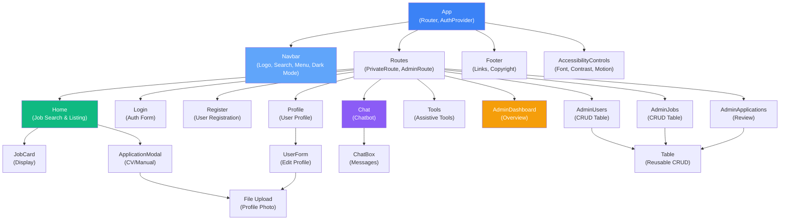

---

### 4.6.4. Accessibility Features

**Implemented in React:**

| Feature | Implementation | Benefit |
|---------|---|---|
| **Dark/Light Mode** | localStorage, CSS classes, tailwind dark: | Reduces eye strain, supports WCAG contrast |
| **Font Size Adjustment** | CSS variable `--font-scale: 0.75-1.5` | Aids users with low vision |
| **High Contrast Mode** | Class toggle, black/white/yellow palette | Improves readability for color-blind users |
| **Reduced Motion** | `prefers-reduced-motion`, disable animations | Helps users with vestibular disorders |
| **Keyboard Navigation** | tabindex, focus indicators, ARIA labels | Supports keyboard-only users |
| **Skip Link** | `sr-only` component with focus:not-sr-only | Jump to main content |
| **Screen Reader Support** | ARIA labels, semantic HTML, ARIA roles | Works with assistive technology |
| **Responsive Design** | Mobile-first, 3 breakpoints | Accessible on all devices |
| **Form Labels** | `<label htmlFor="id">` patterns | Screen reader association |
| **Error Messages** | Semantic, descriptive, ARIA live regions | Clear feedback for accessibility tools |

**WCAG AA Compliance Checklist:**

- ✅ 1.4.3 Contrast (Min) – 4.5:1 for normal text, 3:1 for large text
- ✅ 2.1.1 Keyboard – All functionality available via keyboard
- ✅ 2.1.2 No Keyboard Trap – User can exit any element with keyboard
- ✅ 2.4.3 Focus Order – Logical focus order
- ✅ 2.4.7 Focus Visible – Visible focus indicator on all interactive elements
- ✅ 3.2.4 Consistent Identification – Components behave consistently
- ✅ 4.1.3 Status Messages – ARIA live regions for dynamic updates
- ✅ 3.3.1 Error Identification – Clear error messages and recovery options

---

### 4.6.5. Responsive Design Examples

#### Breakpoint: Mobile (< 640px)

```
Single Column Layout
┌─────────────┐
│   Navbar    │
├─────────────┤
│             │
│ Content     │
│ (Full Width)│
│             │
│             │
├─────────────┤
│   Footer    │
└─────────────┘

Grid: 1 column
Padding: 12px
Cards: Full width
Navigation: Hamburger menu
```

#### Breakpoint: Tablet (640-1024px)

```
Two Column Layout
┌─────────────────────────────┐
│   Navbar (Simplified)       │
├──────────────┬──────────────┤
│              │              │
│  Sidebar     │  Content     │
│              │              │
│              │              │
├──────────────┴──────────────┤
│   Footer                     │
└─────────────────────────────┘

Grid: 2 columns
Padding: 16px
Cards: Side-by-side
Navigation: Simplified menu
```

#### Breakpoint: Desktop (> 1024px)

```
Three+ Column Layout
┌──────────────────────────────────┐
│   Navbar (Full)                  │
├──────────┬──────────┬────────────┤
│          │          │            │
│ Sidebar  │ Main     │ Secondary  │
│          │ Content  │ Content    │
│          │          │            │
├──────────┴──────────┴────────────┤
│   Footer                         │
└──────────────────────────────────┘

Grid: 3-4 columns
Padding: 20-24px
Cards: Multiple per row
Navigation: Full menu + sidebar
```

---

### 4.6.6. Component API Examples

#### JobCard Component

```jsx
<JobCard
  jobId={42}
  title="Senior React Developer"
  company="TechCorp"
  location="Remote"
  relevanceScore={0.95}
  disabilities={["Visual", "Mobility"]}
  employmentType="full-time"
  remoteType="remote"
  onApply={() => openApplicationModal(42)}
/>
```

#### ApplicationModal Component

```jsx
<ApplicationModal
  jobId={42}
  jobTitle="Senior React Developer"
  userId={user.id}
  userEmail={user.email}
  onClose={() => setModalOpen(false)}
  onSuccess={() => {
    refetchApplications();
    setModalOpen(false);
  }}
/>
```

#### ChatBox Component

```jsx
<ChatBox
  userId={user.id}
  onSendMessage={async (message) => {
    const response = await api.post('/chat/', {
      user_id: userId,
      message: message
    });
    return response.data.response;
  }}
/>
```

---

## 4.7. Database Schema Summary

### Entity Relationships

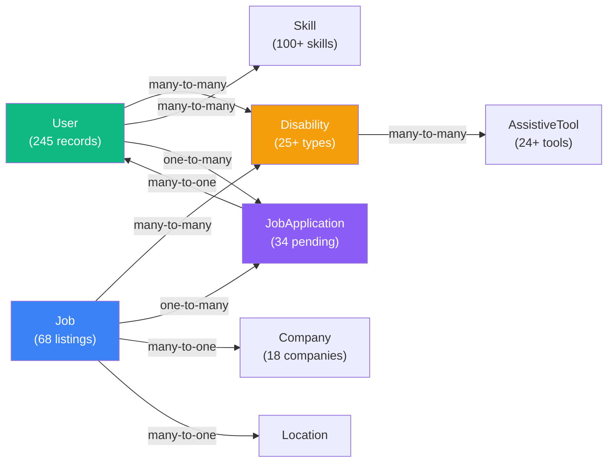

---

## 4.8. Security & Validation Rules

### Input Validation Pipeline

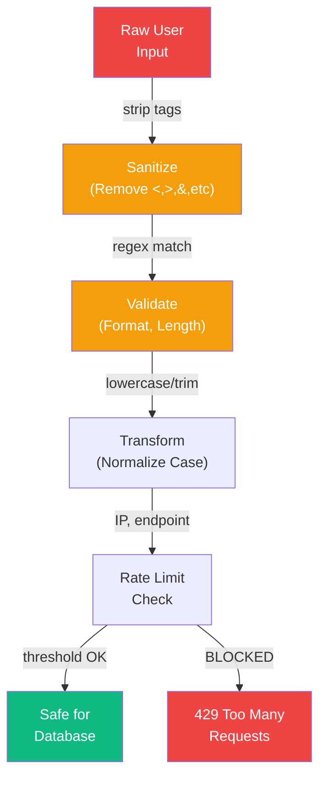

### Rate Limiting Strategy

| Endpoint | Method | Limit | Window |
|----------|--------|-------|--------|
| /users/add_user | POST | 5 | 5 min (300s) |
| /users/login | POST | 5 | 5 min |
| /applications/apply | POST | 10 | 5 min |
| /chat | POST | 20 | 60 sec |
| /jobs/search_jobs | POST | 30 | 1 min |

---

## 4.9. Performance Optimization

### Query Optimization

```python
# ❌ Bad: N+1 Query Problem
jobs = db.query(models.Job).all()
for job in jobs:
    disabilities = job.disabilities  # Extra query per job!

# ✅ Good: Eager Loading
jobs = db.query(models.Job).options(
    selectinload(models.Job.disabilities)
).all()
```

### Database Indexing

```sql
-- Frequently queried columns
CREATE INDEX idx_user_email ON users(email);
CREATE INDEX idx_job_company_id ON jobs(company_id);
CREATE INDEX idx_app_job_id ON job_applications(job_id);
CREATE INDEX idx_app_user_id ON job_applications(user_id);
CREATE INDEX idx_app_status ON job_applications(status);
```

---

## Summary

Chapter 4 provides complete system design documentation including:

1. **DFD Level 0 & 1** – Context and detailed data flows (Mermaid)
2. **State Diagrams** – Application, session, and search filter states (Mermaid)
3. **Use Case Diagrams** – Job seeker, admin, and system use cases (Mermaid)
4. **UI Design** – 8 detailed page layouts, component hierarchy, accessibility features
5. **Database Schema** – Entity relationships and optimization strategies
6. **Security** – Input validation, sanitization, rate limiting
7. **Performance** – Query optimization, indexing, eager loading

All diagrams are implemented in Mermaid format for easy rendering in GitHub, Markdown, and documentation tools.
